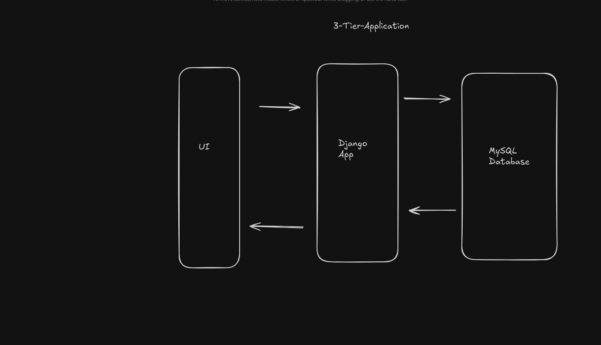

# Deploying a 3-tier application on Kubernetes

## UI
- This will be represeneted by the `swagger-ui`
- This is what the user will interact with

## Django app(Twender-App)
- This is the main logic of the application
- functionality:
    > User creation
    > user validation
    > User login
    > trip creation
    > payment
    > payment validation
    > trip update

## MySQL Database
- Stores all data processed by the django app
- offers data on-request