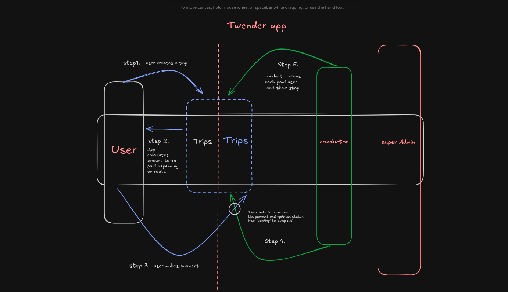

# Twender

## Structure
-Twender
    - Users App: Handles user registration, login an profiles
    - Trips Apps: Manages journeys - creating trips, calculating fares, view trip history
    - Payment App: Handlin payment logic
    - Conductors App: conductor app for viewing pasengers and confirming payments

### Users
- These are the end users of the application
- 

### Trips
- These are the trips a user takes
- A trips are divided into routes which in-turn are sub-divided into stops e.g 
    Route: Thika Road
        stops: Nairobi CBD 
                Nagara
                Muthaiga
                Survery
                Allsoaps
                Garden City
                Roysambu
                Githurai
                Wendani
                KU
                Bypass
                Kihunguro
                Ruiru
                Kairo
                Kimbo
                Toll
                Kroad
                Juja
                Seawage
                Witeithie
                Jomoko
                Thika Town
- each stop has its own order number to save the user the headache of making the typo
- A complete trip is one that has a specified `pickup_location` and `drop_off_locations`
- Depending on the time, the app automatically calculates the `fare` amount a user should pay
- 

### Payments
- MVP version requires you to make manual payments and the conductor confirms and updates the payment status
- The main app should have a specified payment gateway setup

### Conductor app
- The conductor is like an administrator, they get to see the list of people in the matatu and the their stops.
- A conductor can also make updates to the payment status from `pending` to `completed` once he/she confirms

